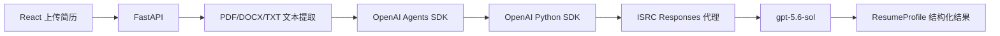

# 工程问题复盘 001：Agents SDK 与自定义 Responses 代理的兼容性

> 这不是一个单纯的“改个版本号”问题，而是一次完整的 Agent 工程化排障：应用、Agent 框架、模型 SDK、Responses 协议和自定义代理之间的接口合约发生了偏移。

## 1. 事件摘要

| 项目 | 内容 |
| --- | --- |
| 日期 | 2026-09-06 |
| 模块 | 简历上传与 Agents SDK 结构化解析 |
| 现象 | 上传简历后接口返回 422，前端显示 `InputTokensDetails.cache_write_tokens` 校验失败 |
| 影响 | 大模型解析无法启动，上传流程中断 |
| 根因 | `openai-agents 0.8.4` 与已验证的 `openai 2.45.0–2.48.0` 之间存在 token usage 数据模型不兼容 |
| 状态 | 已修复，已加回归测试，已提交到 `main` |
| 修复提交 | [`22b4746`](https://github.com/BigWhiiiiite/Zhida-agent/commit/22b4746) |

## 2. 项目背景

职达的简历解析链路为：



当时的主要配置：

```text
Agent 框架：openai-agents 0.8.4
模型 SDK：openai 2.48.0（由宽松版本范围自动安装）
数据校验：Pydantic 2.13.5
模型：gpt-5.6-sol
协议：Responses API
代理：https://llmapi.isrc.ac.cn/v1
```

## 3. 问题现象

用户上传简历后，前端收到：

```text
1 validation error for InputTokensDetails
cache_write_tokens
Field required [type=missing, input_value={'cached_tokens': 0}, input_type=dict]
```

这个错误容易让人第一时间认为：“ISRC 代理返回的 `usage.input_tokens_details` 缺少字段”。

但完整调用栈显示，错误发生在网络请求之前：

```text
agents.run
  -> ensure_context_wrapper
  -> RunContextWrapper
  -> agents.usage.Usage default_factory
  -> InputTokensDetails(cached_tokens=0)
  -> Pydantic ValidationError
```

也就是说，模型请求甚至还没有发出。

## 4. 根因分析

### 4.1 根因一：上下游 SDK 的类型定义不同步

`openai-agents 0.8.4` 在初始化用量统计时使用了类似下面的逻辑：

```python
InputTokensDetails(cached_tokens=0)
```

而新版 `openai` SDK 中的模型已经要求：

```python
class InputTokensDetails(BaseModel):
    cache_write_tokens: int
    cached_tokens: int
```

因此，Agents SDK 只传入 `cached_tokens` 时，Pydantic 会在 Agent 运行初始化阶段立即拒绝该对象。

我们对版本边界做了实际验证：

| `openai` 版本 | `Usage()` 能否初始化 |
| --- | --- |
| 2.48.0 | 失败 |
| 2.47.0 | 失败 |
| 2.46.0 | 失败 |
| 2.45.0 | 失败 |
| 2.44.0 | 成功 |

这说明问题不在简历文本、Pydantic 的 `ResumeProfile` 或前端上传逻辑，而是依赖组合本身。

### 4.2 根因二：Codex 配置语义不等于 Responses 线上协议

解决版本错配后，真实请求继续执行，又收到了一个新的 400：

```text
Invalid value: 'ultra'. Supported values are:
'none', 'minimal', 'low', 'medium', 'high', 'xhigh', and 'max'.
```

`ultra` 是 Codex 配置层的推理强度档位，但当前该 Responses 代理在线上协议中接受的最高值是 `max`。直接把 Codex 配置复制到 API 请求中会导致参数不兼容。

### 4.3 独立问题：代理上游的间歇性 502

修复上述两个本地问题后，真实结构化请求成功返回过：

```python
{"ok": True}
```

随后相同级别的最小请求也出现了：

```text
502 Upstream request failed, please try again (Relay Service)
```

最小请求和完整简历 Schema 都能触发 502，且 OpenAI SDK 已经自动重试，因此它与最初的 Pydantic 错误是两个独立问题：

- Pydantic 错误：本地依赖契约问题，可以由项目修复。
- 400 `ultra`：客户端配置映射问题，可以由项目修复。
- 502 Relay Service：外部服务可用性问题，项目只能重试、降级并给出清晰提示。

## 5. 排查过程

### 第一步：核对协议而不猜测

查看 OpenAI Responses API 的官方结构，确认新版 `usage.input_tokens_details` 包含：

```json
{
  "cached_tokens": 0,
  "cache_write_tokens": 0
}
```

参考：[OpenAI Responses API](https://developers.openai.com/api/reference/cli/resources/responses/methods/create)

### 第二步：用完整调用栈确定失败边界

前端错误只显示了 Pydantic 校验结果，不能说明错误发生在“请求前”还是“响应后”。因此使用不含候选人数据的最小 Agent 请求获取完整调用栈。

关键证据是错误落在 `RunContextWrapper` 的 `Usage` 初始化中，还没有进入 HTTP 请求。

### 第三步：构造最小可复现样例

脱离简历上传、FastAPI 和前端，直接运行：

```python
from agents.usage import Usage

Usage()
```

如果这一行就失败，证明问题与业务数据无关。

### 第四步：对依赖版本做边界实验

保持 `openai-agents==0.8.4` 不变，依次测试 `openai` 2.48.0 到 2.44.0，最终确定 2.44.0 是当前组合中能正常初始化的版本。

### 第五步：分层验证

修复后依次验证：

1. `Usage()` 可正常初始化。
2. 代理响应规范化单元测试通过。
3. `pip check` 显示没有破损的依赖。
4. 后端冒烟测试通过。
5. 最小 Agents SDK 结构化请求成功返回。
6. FastAPI 重启后健康检查通过。

## 6. 最终解决方案

### 6.1 锁定已验证的依赖组合

```text
openai-agents==0.8.4
openai==2.44.0
```

之前使用 `openai-agents>=0.6.0,<1` 会让新环境在不同时间安装出不同的依赖图。锁定版本后，本地、CI 和部署环境才能复现同样的行为。

### 6.2 增加 Responses 代理兼容层

在 `model_provider.py` 中加入局部 HTTP 响应规范化：

- 只处理成功的 JSON `/responses` 响应。
- 只修复 `usage` 中缺失的计数字段。
- 缺失的 `cached_tokens`、`cache_write_tokens` 和 `reasoning_tokens` 默认为 `0`。
- 不修改模型生成内容、结构化结果或业务字段。

这是一个“反腐层”：将外部代理与标准 Responses 协议的细小差异，隔离在一个明确的 provider adapter 中，而不是把兼容代码散落在简历解析器和表单 Agent 里。

### 6.3 增加配置映射

```python
wire_effort = "max" if effort.lower() == "ultra" else effort.lower()
```

这让项目仍然可以接受用户熟悉的 Codex `ultra` 配置，但在发送到 Responses API 前转换为实际支持的 `max`。

### 6.4 加入回归测试

回归测试覆盖两个曾经失败的最小单元：

```python
assert Usage().input_tokens_details.cached_tokens == 0
```

以及代理响应缺少 `cache_write_tokens` 时的规范化。这样未来升级依赖时，CI 会在代码发布前发现同类破坏。

## 7. 为什么不采用其他方案

### 不直接修改 `site-packages`

直接修改虚拟环境里的 `agents/usage.py` 虽然能快速消除错误，但重新安装依赖后修改就会消失，也无法由 Git 记录和复现。

### 不在业务层捕获并忽略所有 Pydantic 错误

宽泛地忽略校验错误会同时吞掉真正的简历数据质量问题。本次修复只处理已知的 SDK 契约差异，仍然保留 `ResumeProfile` 的严格验证。

### 不把所有 502 都当成本地代码错误

502 发生在代理服务器与上游模型之间。本地可以重试和降级，但不应为了“让测试变绿”而伪造模型结果。

## 8. 数据安全处理

排查过程遵循了最小数据原则：

- 不打印或读取 `ISRC_API_KEY`。
- 不将 `backend/.env` 纳入 Git。
- 不使用用户真实简历进行底层兼容测试。
- 首先使用 `Reply with exactly OK` 和虚构简历进行最小请求。
- 日志不应在生产环境记录完整简历文本。

## 9. 从这次事件得到的工程经验

1. **OpenAI-compatible 不等于完全兼容。** 请求路径一样只是第一层，响应字段、枚举值、流式事件和错误语义都可能存在差异。
2. **Agent 框架本身也是依赖风险源。** 错误不一定来自模型或 prompt，也可能在 Agent loop 初始化阶段。
3. **完整调用栈比前端错误文案更重要。** 同一个 Pydantic 错误，可能发生在本地对象初始化，也可能发生在外部响应解析，两者解法完全不同。
4. **版本范围不等于可重复构建。** 对核心 Agent 运行链路，应锁定经过联调的精确版本。
5. **配置也需要 adapter。** 不同客户端的同名或近似配置不一定具有相同的 wire-level 语义。
6. **外部故障必须与本地故障分类。** 否则用户会把 502、配置 400 和数据校验错误都理解成“简历解析失败”。
7. **最小复现样例应进入回归测试。** 只有这样，排障经验才会变成项目能力，而不是留在某个人的记忆中。

## 10. 后续改进清单

- [ ] 为模型代理增加独立的 contract test，使用虚构数据验证 Responses 协议。
- [ ] 在 CI 中执行 `Usage()` 和后端冒烟测试。
- [ ] 为 400 配置错误、422 业务数据错误和 502 代理错误设计不同的前端提示。
- [ ] 对 429/502/503 实现带抖动的指数退避和最大重试上限。
- [ ] 模型不可用时保留已上传文件的“待重试”状态，避免用户重复上传。
- [ ] 记录不含 PII 的 provider、状态码、request ID、延迟和重试次数。
- [ ] 升级 Agents SDK 时先在独立分支重跑兼容矩阵，再放开 `openai==2.44.0` 的临时锁定。
- [ ] 对连续失败的代理增加熔断与本地规则降级，但必须在 UI 中明确标记“非 AI 解析”。

## 11. 面试 STAR 讲法

### Situation：背景

我在做一个求职投递 Agent，用 React 和 FastAPI 搭建产品，用 OpenAI Agents SDK 调用自定义 Responses 代理，将 PDF/DOCX 简历转换成严格的 Pydantic 候选人档案。

### Task：任务

简历上传后出现 `InputTokensDetails.cache_write_tokens` 校验失败。我需要判断问题究竟来自简历 Schema、代理响应，还是 Agent SDK 本身，并给出可复现、可回归的解决方案。

### Action：行动

1. 对照 Responses API 官方结构，确认 token usage 字段变化。
2. 用最小 Agent 请求获取完整调用栈，发现失败发生在 HTTP 请求之前的 `Usage()` 初始化。
3. 通过多个 `openai` 小版本的边界实验，确定 2.44.0 与当前 Agents SDK 兼容。
4. 锁定依赖，并在 provider adapter 中规范化代理遗漏的 usage 计数字段。
5. 对 Codex `ultra` 和 Responses `max` 做显式配置映射。
6. 把最小复现条件加入冒烟测试，再用不含个人信息的真实结构化请求验证。

### Result：结果

- 原始 Pydantic 错误消失。
- Agent 可以正常初始化并成功完成结构化请求。
- 配置层自动兼容 `ultra` 与 `max`。
- 依赖组合和代理契约都有回归测试。
- 同时识别出代理间歇性 502 是独立的外部可用性问题，避免继续误改业务代码。

## 12. 60 秒面试口述版

> 我在做求职投递 Agent 时，遇到一个比较典型的 Agent 工程化兼容问题。用户上传简历后，系统报 `InputTokensDetails` 缺少 `cache_write_tokens`。表面上很像是模型代理返回了错误数据，但我通过最小复现和完整调用栈发现，错误其实发生在网络请求之前：Agents SDK 0.8.4 仍按旧类型初始化 token usage，而新版 OpenAI SDK 已经将新字段设为必填。我对 2.48 到 2.44 做了版本边界实验，锁定了可用组合，又在 provider adapter 中加了 Responses usage 规范化，并把 Codex 的 `ultra` 映射到 API 支持的 `max`。最后我用单元测试、冒烟测试和真实结构化请求分层验证。这件事让我意识到，OpenAI-compatible 并不代表完全兼容，Agent 项目必须对依赖和代理协议都做契约测试。

## 13. 面试追问准备

### Q1：为什么不直接升级 Agents SDK？

当时已经安装了当前依赖解析得到的新版 Agents SDK，但它与同期更新的 OpenAI SDK 仍有类型定义时间差。对正在落地的项目，先锁定已验证的组合比继续追新更稳妥，后续再通过兼容矩阵有计划地升级。

### Q2：为什么既锁版本又加响应规范化？

两者解决不同层次的问题：锁版本解决本地 SDK 初始化不兼容；响应规范化解决自定义代理与标准 Responses 响应之间的差异。

### Q3：给缺失 token 字段填 `0` 安全吗？

这些字段只用于用量统计，不影响模型输出和业务决策。兼容层也仅在字段缺失时填充，不会覆盖代理已返回的数值。但在生产计费中不应把这个默认值当成准确账单，计费应以 provider 侧数据为准。

### Q4：如何区分业务错误和外部服务错误？

根据失败边界和 HTTP 状态分类：请求前的类型错误属于本地依赖或代码；有明确参数提示的 400 属于配置或协议错误；稳定复现的 422 可能是业务数据校验；代理返回的 502/503 属于可用性故障，需要重试、熔断或降级。

### Q5：这次修复如何避免回归？

通过精确依赖版本、最小 `Usage()` 测试、代理响应规范化测试和后端冒烟测试四层保护。后续还需要把真实 provider contract test 放入受保护的 CI 环境。
